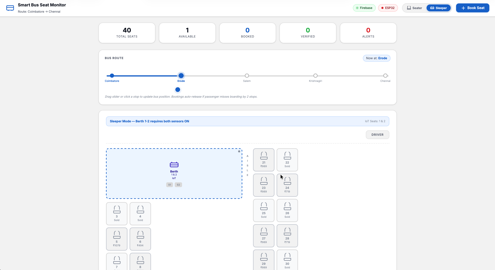

  <h1 align="center">Smart Bus Fleet Monitoring System</h1>
  
Research Prototype | Proof of Concept

  

    A seat occupancy–based monitoring system designed to detect unauthorized passengers 
    in long-route bus operations and improve revenue transparency for fleet owners.
  

  

**Problem Statement**

In long-distance bus operations, unauthorized passenger boarding is a frequent issue that leads to revenue leakage for fleet owners. Drivers may allow passengers to travel without issuing official tickets and collect the fare directly, making these transactions invisible to the fleet management system. Since the bus owner has no reliable way to verify the actual number of passengers inside the vehicle during a trip, it becomes difficult to detect such discrepancies.

Current fleet management solutions mainly track vehicle location, fuel usage, and route performance but lack mechanisms to monitor real-time seat occupancy. This creates a gap between the recorded ticket data and the actual number of passengers traveling. To address this challenge, a seat occupancy sensing system can be deployed in buses to monitor real-time seat usage and compare it with ticketing records, enabling the detection of unauthorized passengers and improving revenue transparency in fleet operations.
